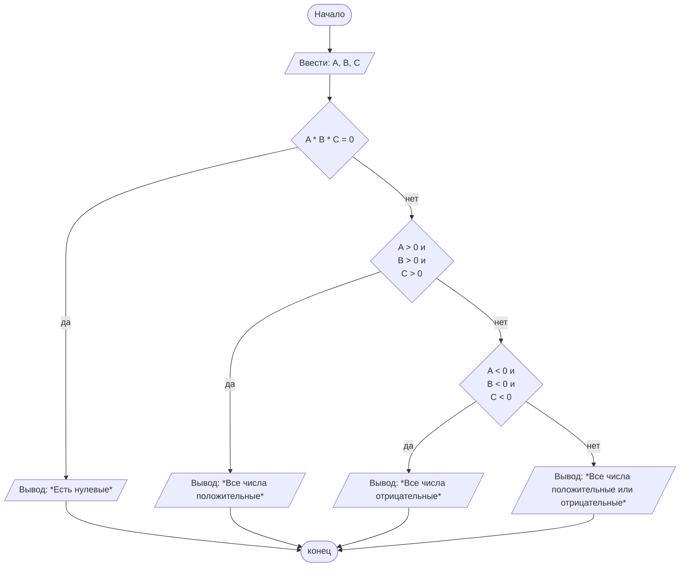

## Отчет по лабораторной работе № 2

#### № группы: `ПМ-2502`

#### Выполнил: `Вопияшин Артём Алексеевич`

#### Вариант: `2`

### Cодержание:

- [Постановка задачи](#1-постановка-задачи)
- [Входные и выходные данные](#2-входные-и-выходные-данные)
- [Выбор структуры данных](#3-выбор-структуры-данных)
- [Алгоритм](#4-алгоритм)
- [Программа](#5-программа)
- [Анализ правильности решения](#6-анализ-правильности-решения)

### 1. Постановка задачи

> На вход программы подаются три целых числа A, B, C. Необходимо вывести одно из следующих сообщений в зависимости от значений чисел:
> - «Все числа положительные», если все три числа больше нуля.
> - «Все числа отрицательные», если все три числа меньше нуля.
> - «Все числа положительные или отрицательные», если среди чисел есть как положительные, так и отрицательные.
> - «Есть нулевые», если хотя бы одно из чисел равно нулю.
 
 

#### **Данную задачу можно решить, построив цепочку if-else:**

Если среди чисел есть число, равное нулю (если произведение всех чисел равно 0):
- вывести последнее сообщение;
  
Если все числа положительные (сравнить каждое число с нулём по отдельности):
- вывести первое сообщение;
  
Если все числа отрицательные (аналогично с предыдущим пунктом):
- вывести второе сообщение;
  
В ином случае вывести третье сообщение.

### 2. Входные и выходные данные

#### Данные на вход

На вход программа должна получать 3 целых числа A, B, C. В условии не указаны ограничения для целых чисел, поэтому будем считать, что их максимальное и минимальное значения не превышают допустимых значений типа данных long.

|   | Тип                | min значение     | max значение       | 
|---|--------------------|------------------|--------------------|
| A | Целое число (long) | -2<sup>63</sup>  | 2<sup>63</sup> - 1 |
| B | Целое число (long) | -2<sup>63</sup>  | 2<sup>63</sup> - 1 |
| C | Целое число (long) | -2<sup>63</sup>  | 2<sup>63</sup> - 1 |

#### Данные на выход

По условию задачи, на выход мы получаем одно из следующих сообщений:
- "Все числа положительные";
- "Все числа отрицательные";
- "Все числа положительные или отрицательные";
- "Есть нулевые".

### 3. Выбор структуры данных

Программа получает 3 целых числа, поэтому для их хранения можно выделить 3 переменных (`A`, `B` и `C`) типа `long`.

|   | название переменной | Тип (в Java)| 
|---|---------------------|-------------|
| A | `A`                 | `long`      |
| B | `B`                 | `long`      | 
| C | `C`                 | `long`      | 

Для вывода результата необязательно его хранить в отдельной переменной.

### 4. Алгоритм

#### Алгоритм выполнения программы:

1. **Ввод данных:**  
   Программа считывает три целых числа, обозначенные как `A`, `B` и `C`.

2. **Проверка на наличие нулей**
   Если произведение всех чисел равно нулю, то на экран выводится "Есть нулевые".
   В ином случае идёт проверка на следующее условие.
   
4. **Проверка, если все числа положительные**
   Если каждое число больше нуля, то на экран выводится "Все числа положительные".

5. **Проверка, если все числа отрицательные**
   Если каждое числа меньше нуля, то на экран выводится "Все числа отрицательные".
   
6. **Случай, если все предыдущие условия не выполнены**
   Если все все предыдущие условия не были выполнены, то получается, что среди чисел нет нулей и хотя бы одно число имеет отличный от остальных знак. Тогда на экран выводится "Все числа положительные или отрицательные"


#### Блок-схема



### 5. Программа

```java
import java.io.PrintStream;
import java.util.Scanner;

public class Main {
    // Объявляем объект класса Scanner для ввода данных
    public static Scanner in = new Scanner(System.in);
    // Объявляем объект класса PrintStream для вывода данных
    public static PrintStream out = System.out;

    public static void main(String[] args) {
        // Считываем значения трёх целочисленных значений из консоли
        long A = in.nextLong();
        long B = in.nextLong();
        long C = in.nextLong();

        // Проверяем, есть ли нуль среди введённых чисел и выводим следующее сообщение, если есть
        if (A*B*C == 0) {
            out.println("Есть нулевые");
        }
        else {
            // Если нуля среди чисел нет, то проверяем, все ли числа положительные,
            // и выводим следующее сообщение, если это так
            if (A > 0 && B > 0 && C > 0) {
                out.println("Все числа положительные");
            }
            else {
                // Если не все числа положительные, проверяем являются ли все числа отрицательными,
                // и выводим следующее сообщение, если это так
                if (A < 0 && B < 0 && C < 0) {
                    out.println("Все числа отрицательные");
                }
                else {
                    // Если ни одно условие выполнено не было, то выводится следующее сообщение
                    out.println("Все числа положительные или отрицательные");
                }
            }
        }

    }
}
```

### 6. Анализ правильности решения

Программа работает корректно на всем множестве решений. Далее разобраны примеры для каждого варианта вывода программы:

1. ***Присутствуют нули:***
   
   *Нуль на первом месте:*

    - **Input**:
        ```
        0 5 3
        ```

    - **Output**:
        ```
        Есть нулевые
        ```
   *Нуль на втором месте:*
    - **Input**:
        ```
        8 0 3
        ```

    - **Output**:
        ```
        Есть нулевые
        ```


   *Нуль на третьем месте:*
   - **Input**:
        ```
        2 7 0
        ```

    - **Output**:
        ```
        Есть нулевые
        ```

   *Два нуля на первом и втором местах:*
   - **Input**:
        ```
        0 0 2
        ```

    - **Output**:
        ```
        Есть нулевые
        ```

   *Два нуля на первом и третьем местах:*
   - **Input**:
        ```
        0 5 0
        ```

    - **Output**:
        ```
        Есть нулевые
        ```

   *Два нуля на втором и третьем местах:*
   - **Input**:
        ```
        9 0 0
        ```

    - **Output**:
        ```
        Есть нулевые
        ```


   *Все числа - нули:*
      - **Input**:
        ```
        0 0 0
        ```

    - **Output**:
        ```
        Есть нулевые
        ```

3. ***Все числа положительные:***

    - **Input**:
        ```
        5 6 2
        ```

    - **Output**:
        ```
        Все числа положительные
        ```

4. ***Все числа отрицательные:***

    - **Input**:
        ```
        -4 -5 -8
        ```

    - **Output**:
        ```
        Все числа отрицательные
        ```

5. ***Присутствютуют положительные и отрицательные числа (без нулей):***

   *Отрицательное число на первом месте:*

    - **Input**:
        ```
        -1 3 5
        ```

    - **Output**:
        ```
        Все числа положительные или отрицательные
        ```

   *Отрицательное число на втором месте:*
    - **Input**:
        ```
        1 -3 5
        ```

    - **Output**:
        ```
        Все числа положительные или отрицательные
        ```


   *Отрицательное число на третьем месте:*
    - **Input**:
        ```
        1 3 -5
        ```

    - **Output**:
        ```
        Все числа положительные или отрицательные
        ```

   *Отрицательные числа на первом и втором местах:*
    - **Input**:
        ```
        -8 -5 4
        ```

    - **Output**:
        ```
        Все числа положительные или отрицательные
        ```


   *Отрицательные числа на втором и тертьем местах:*
    - **Input**:
        ```
        1 -3 -5
        ```

    - **Output**:
        ```
        Все числа положительные или отрицательные
        ```


   *Отрицательные числа на первом и третьем местах:*
    - **Input**:
        ```
        -1 3 -5
        ```

    - **Output**:
        ```
        Все числа положительные или отрицательные
        ```


   
